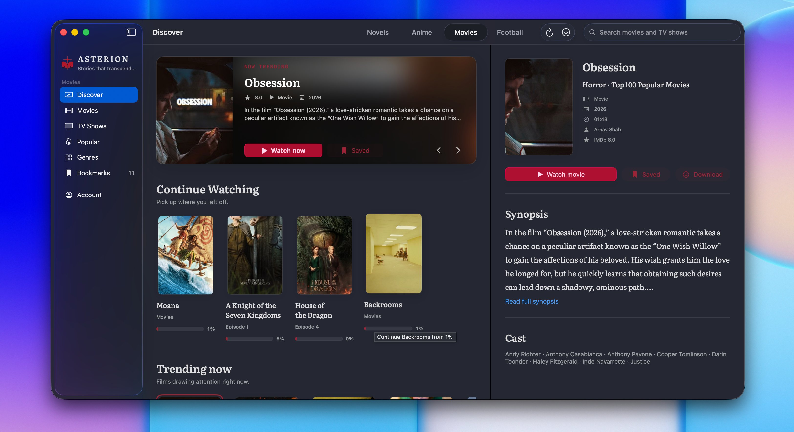

<div align="center">
  
  <h1>Asterion</h1>
  <p><strong>Stories that transcend time.</strong></p>
  <p>A native Apple app for reading novels and enjoying anime, movies, television, and live football.</p>
  <p>
    <a href="https://github.com/CyberVerse2/asterion-ios/releases/latest/download/Asterion.dmg">
      
    </a>
  </p>
</div>



## The experience

Asterion brings discovery, playback, reading, downloads, and progress tracking into a focused Apple-native experience. The macOS app is the complete product; the iPhone and iPad app is a dedicated novel reader designed for reading on the move.

| Experience | What it includes |
| --- | --- |
| macOS | Novels, anime, movies, TV shows, live football, downloads, bookmarks, viewing history, and separate reader and player windows |
| iPhone and iPad | Novel discovery, rankings, library, an immersive reader, offline chapters, synced progress, a Home Screen widget, Siri shortcuts, and download Live Activities |

Sign-in is powered by Clerk. Account data, bookmarks, reading progress, and viewing progress sync through the Asterion API. Work completed while offline is saved locally and uploaded when the app reconnects.

## Run Asterion

The clients use Asterion's deployed services by default, so you can work on either Apple app without running the backend or scraper services locally.

### macOS

You need macOS 26 or later, Swift 6.2 tooling, and a valid Apple code-signing identity. Signing keeps Clerk's Keychain access trusted between builds.

```sh
cd AsterionMac
./script/build_and_run.sh --verify
```

The script builds the Swift package, creates `AsterionMac/dist/Asterion.app`, signs it, launches it, and checks that it stays running.

Run the macOS test suite with:

```sh
cd AsterionMac
swift test
```

See [AsterionMac/README.md](AsterionMac/README.md) for debugging, telemetry, DMG packaging, and release-signing options.

### iPhone and iPad

You need an Apple development environment that can build the iOS 18 deployment target.

1. Open `Asterion.xcodeproj`.
2. Select the `Asterion` scheme and an iPhone or iPad destination.
3. Choose your development team under Signing & Capabilities.
4. Use app and widget bundle identifiers, plus an App Group, that belong to your team.
5. Build and run from Xcode.

For a connected device, the repository also includes a repeatable build-install-launch command:

```sh
ASTERION_DEVICE_ID="YOUR_DEVICE_IDENTIFIER" ./scripts/build-install-launch-iphone.sh
```

Use `./scripts/build-install-launch-ipad.sh` for the iPad build path.

## Run the API locally

The shared API stores accounts, libraries, bookmarks, reading progress, viewing progress, and content data. It requires Node.js 20 or later, PostgreSQL, and a Clerk application.

```sh
cd backend
npm install
cp .env.example .env
```

Set the PostgreSQL and Clerk values in `backend/.env`, then prepare the database and start the development server:

```sh
npm run db:push
npm run dev
```

The API listens on `http://localhost:3001` by default. Verify the database connection with `GET /health`, or run the smoke test from another terminal:

```sh
cd backend
npm run smoke
```

The Apple clients compile their service origins into their API clients. To point them at local services, change the relevant base URLs in `Services/APIClient.swift` and `AsterionMac/Sources/AsterionMac/Services/`.

## Service map

| Path | Responsibility | Runtime |
| --- | --- | --- |
| `AsterionMac/` | Full native macOS app | SwiftUI and Swift Package Manager |
| `AppStore/`, `Models/`, `Services/`, `Views/`, `Widgets/`, `Intents/` | Native iPhone and iPad reader | SwiftUI and Xcode |
| `backend/` | Accounts, content, library state, and cross-device progress | Fastify, Drizzle, and PostgreSQL |
| `anime-scraper/` | Anime catalog, episode, subtitle, and playback service | Flask and Gunicorn |
| `movie-scraper/` | Movie and TV catalog and playback service | Flask and Gunicorn |
| `football-scraper/` | Match schedule and live stream service | Flask and Gunicorn |
| `docs/` | Design references, implementation snapshots, and learning notes | Markdown, HTML, and images |

Each scraper service has a `Dockerfile`, a health endpoint at `/api/health`, and focused parser tests. Run a service locally from its directory with:

```sh
python3 -m venv .venv
source .venv/bin/activate
pip install -r requirements.txt
python app.py
```

Run its tests with `python -m unittest` from the same directory.

## Package the macOS app

Create and validate a development-signed DMG with:

```sh
cd AsterionMac
./script/build_and_run.sh --package-development
```

For a public release, provide a production Clerk key and a Developer ID Application identity:

```sh
cd AsterionMac
ASTERION_CLERK_PUBLISHABLE_KEY="pk_live_..." \
ASTERION_CODE_SIGN_IDENTITY="Developer ID Application: …" \
./script/build_and_run.sh --package
```

The release command creates the app and DMG, enables the hardened runtime, verifies both signatures, mounts and inspects the disk image, and writes a SHA-256 checksum. Public distribution still requires Apple notarization.

## Project status

Asterion is under active development. Catalog and playback services depend on external content providers, so operators are responsible for confirming that their use and distribution of content comply with provider terms and applicable law.
